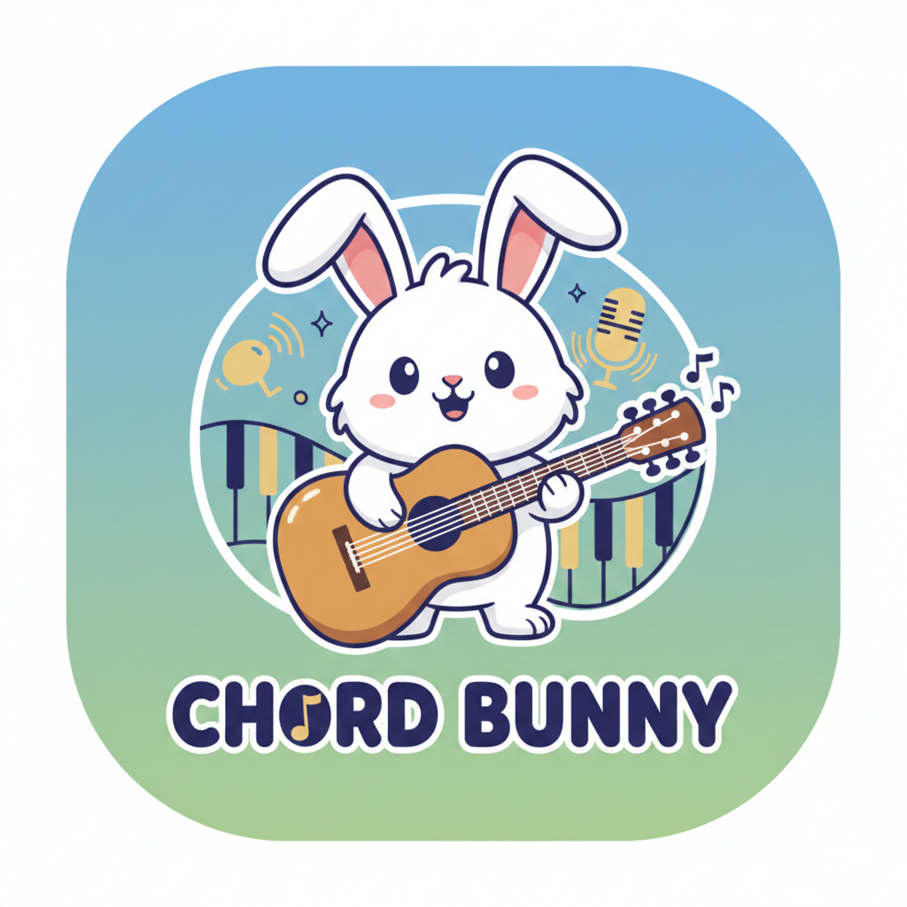

# Chord Bunny 🎸🎹🎶

A web-based practice tool designed to help guitarists improve their chord transitions. Practice your chord changes with a clean, intuitive interface and track your progress over time. (Piano and singing support coming in future updates!)



## Features

- 🎯 Practice chord transitions with a metronome & visual timer
- 🎸 Currently supports guitar (piano and voice support coming soon!)
- ⏱️ Customizable practice session duration
- 🔄 Multiple practice rounds (progress tracking coming soon)
- 🎵 Visual chord diagrams for easy reference

## Getting Started

### Prerequisites

- Node.js (v14 or higher recommended)
- npm (comes with Node.js)

### Installation

1. Clone the repository:
   ```bash
   git clone https://github.com/lihuang1047/chord-bunny.git
   cd chord-bunny
   ```

2. Install dependencies:
   ```bash
   npm install
   ```

### Running Locally

Start the development server:
```bash
npm start
```

Then open your browser and navigate to:
```
http://localhost:8000
```

## How to Use

1. Open the application in your web browser
2. Set your desired practice duration
3. Click "Start" to begin
4. Practice transitioning between the displayed chords
5. The app will automatically advance to the next set of chords
6. Complete all rounds to finish your practice session

## Project Structure

```
chord-bunny/
├── src/
│   ├── assets/         # Chord diagrams and images
│   ├── css/            # Stylesheets
│   └── js/             # JavaScript modules
│       ├── app.js      # Main application logic
│       ├── chordData.js # Chord definitions and data
│       └── chordManager.js # Chord management and transitions
├── index.html          # Main HTML file
└── package.json        # Project configuration and dependencies
```

## Contributing

Contributions are welcome! Please feel free to submit a Pull Request.

1. Fork the repository
2. Create your feature branch (`git checkout -b feature/AmazingFeature`)
3. Commit your changes (`git commit -m 'Add some AmazingFeature'`)
4. Push to the branch (`git push origin feature/AmazingFeature`)
5. Open a Pull Request

## License Philosophy

This project is currently licensed under the GNU Affero General Public License v3 (AGPL-3.0). I've chosen this license because I believe in open source principles, especially for network services built with this software.

### Current License: AGPL-3.0

This is a strong copyleft license that ensures any modifications or derivatives of this software must also be open source.

### Future Licensing

- As the sole maintainer, I reserve the right to change the license in future versions.
- Any license changes will be clearly documented in the release notes and commit history.
- If you contribute code, please be aware it may be re-licensed under different terms in the future.
- While I value stability, I also want to keep my options open to adapt the license as the project evolves.

## License Details

### Key Requirements:
- 🔄 **Source Code Availability**: Anyone who uses or modifies this software must make their modified source code available under the same license
- 🌐 **Network Use is Distribution**: Even hosting the software as a web service requires making the source code available to users
- 📜 **License and Copyright Notice**: Original copyright and license must be preserved
- 🔗 **Same License**: Any derivative works must be licensed under AGPL-3.0

This license is specifically designed for network server software and ensures that the software remains free and open source, even when used to provide a service over a network.

See the full license text in the [LICENSE](LICENSE) file for complete terms and conditions.

## Contact

Li Huang - [@lihuang1047](https://github.com/lihuang1047)

Project Link: [https://github.com/lihuang1047/chord-bunny](https://github.com/lihuang1047/chord-bunny)

## Acknowledgments

- Built with vanilla JavaScript, HTML5, and CSS3
- Uses [vexchords](https://github.com/0xfe/vexchords) for chord diagram rendering
- Inspired by [Chord Bunny](https://www.dkthehuman.com/chord-bunny/) by DK the Human
  - This is an independent implementation created from scratch, but the core concept was inspired by DK's work
